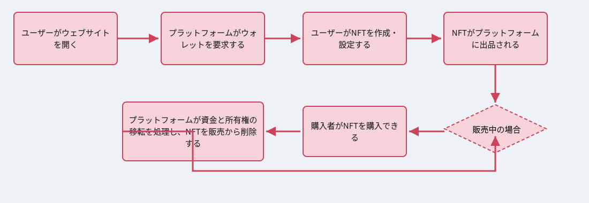
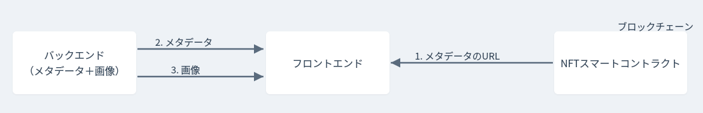

# 概要

🇯🇵 [日本語](README.md) | 🇺🇸 [英語](README.en.md)

- [概要](#about)
- [プレビュー](#preview)
- [アーキテクチャとクライアント側のフロー](#architecture)
- [使用技術](#technologies)
- [使い方](#how-to-use)
- [TODO](#todo)
- [ライセンス](#license)

<a id='about'/>

## :information_source: 概要

Galerieは、デジタルアートをNFTとして作成・販売・購入できるNFTマーケットプレイスです。 <a id='preview'/>

## :framed_picture: プレビュー

実際の画面の様子はこちらです：

<p align="center">

<p />

<a id='architecture' />

## :information_source: アーキテクチャとクライアント側のフロー

<p align="center">

<p />

<p align="center">

<p />


<a id='technologies'/>

## :gear: 使用技術

このプロジェクトは以下の技術を使用して開発されました：

#### **フロントエンド** <sub><sup>React + JavaScript</sup></sub>
- [React](https://pt-br.reactjs.org/)
- [Axios](https://github.com/axios/axios)
- [Redux](https://redux.js.org/)
- [Web3.js](https://web3js.readthedocs.io/en/v1.3.4/)
- [Material UI](https://material-ui.com/pt/)

#### **バックエンド** <sub><sup>Express</sup></sub>
- [Express](https://expressjs.com/pt-br/)

#### **ブロックチェーンとスマートコントラクト** <sub><sup>Solidity</sup></sub>
- [Solidity](https://docs.soliditylang.org/)
- [Truffle](https://www.trufflesuite.com/)
- [Ganache](https://www.trufflesuite.com/ganache)


<a id='how-to-use'/>

## :joystick: 使い方

### 前提条件

アプリケーションを実行するには、以下が必要です：
* [Git](https://git-scm.com)
* [Node](https://nodejs.org/)
* [Yarn](https://yarnpkg.com/) または [npm](https://www.npmjs.com/)
* [Truffle](https://www.trufflesuite.com/)
* [Ganache](https://www.trufflesuite.com/ganache)
* リポジトリをクローンします:
* ```$ git clone https://github.com/JapanFullstackdev/NFTMarket.git ```


プロジェクトフォルダに移動し、以下のコマンドを実行します:


```bash
$ cd NFT-Marketplace

# 依存関係のインストール
$ yarn

# ganacheの起動
$ ganache-cli

# ブロックチェーンへのコントラクトのデプロイ
$ truffle migrate

# クライアント側の実行
$ cd client
$ yarn
$ yarn start

# バックエンドの実行
$ cd backend
$ yarn
$ yarn start
```

<a id='todo'/>

## :page_with_curl: TODO

このプロジェクトには、まだ実装すべき点がいくつかあります:
- 状態の永続化（State persistence）;
- ブロックチェーン上の売買関数を呼び出すフロントエンド処理の修正;
- エラーハンドリング;
- NFTカードへの、ブロックチェーン上の正確な価格情報の反映。

<a id='license'/>

## :page_with_curl: ライセンス

このプロジェクトは **MITライセンス** の下で公開されています。詳細については [LICENSE](https://github.com/JapanFullstackdev/NFTMarket/blob/master/LICENSE) を参照してください。


<br/>
:coffee: と ❤️ を込めて <b>JapaneseFullstack</b> が作成しました。
<p/>
